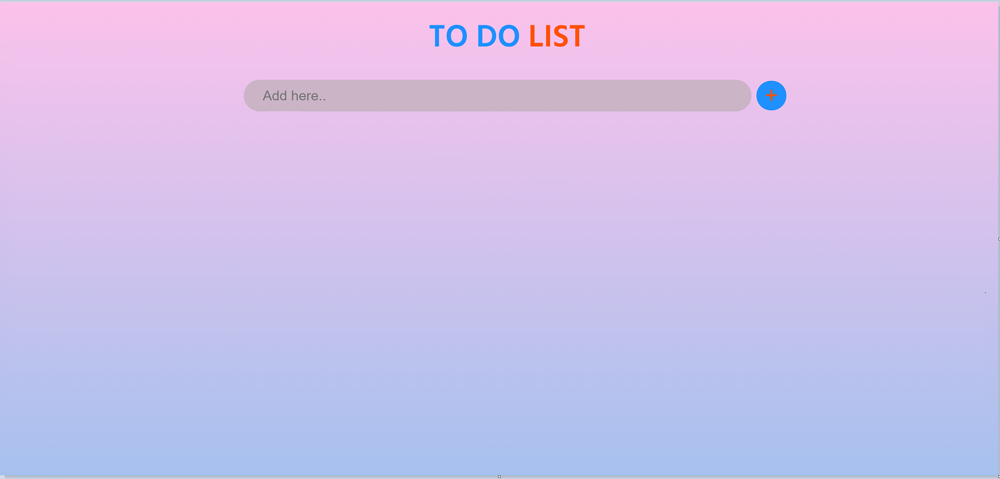

# To-Do-List

Live link to try the project: https://davidhct.github.io/To-Do-List/

### Summary
To do List application is a single page application (SPA) that allows you to manage your tasks. 
The purpose of the project is to learn the Javascript programming language and in addition to learn both HTML5 and CSS3.

